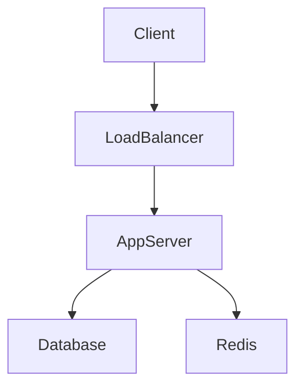
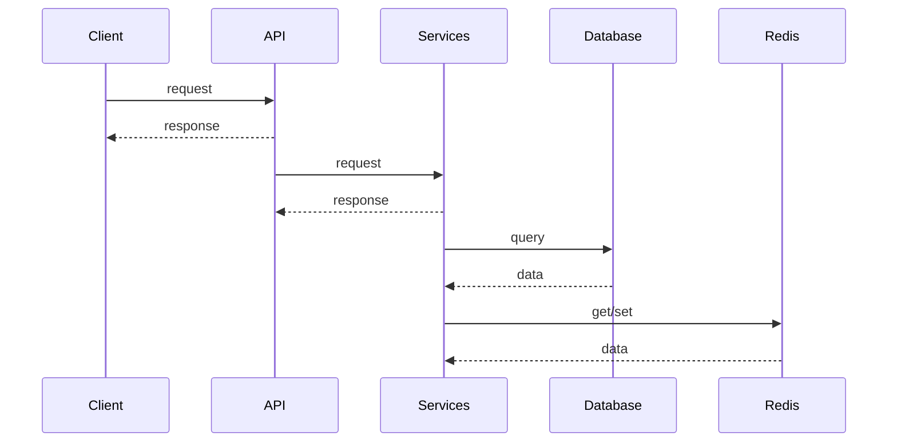
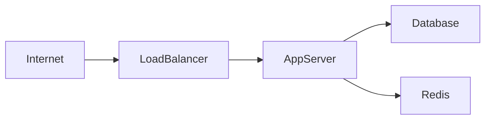
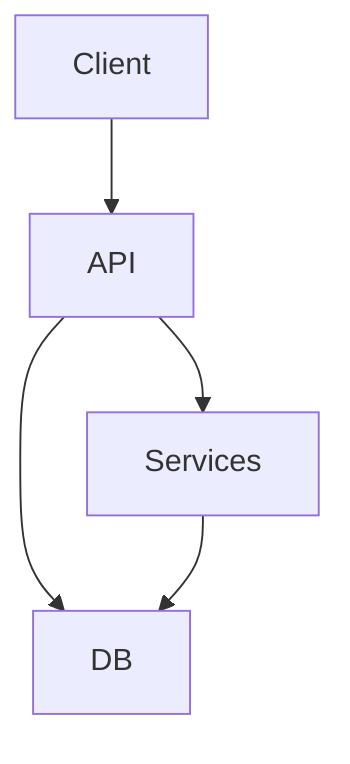
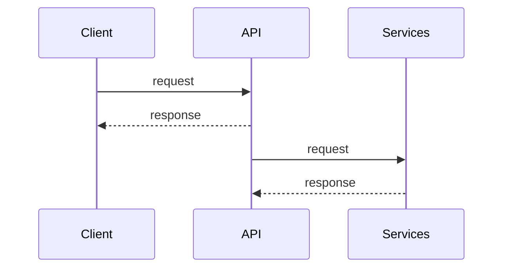

# Architecture
## System Overview
The PyTorch-workflow project is a tool for managing and optimizing PyTorch workflows. At the C4 context level, the system can be described as follows:
```mermaid
graph LR
  User -->|uses|> PyTorch-workflow
  PyTorch-workflow -->|manages|> PyTorch
  PyTorch-workflow -->|optimizes|> PyTorch
  PyTorch-workflow -->|stores data in|> Database
  PyTorch-workflow -->|uses cache from|> Redis
```
The system interacts with the user, PyTorch, the database, and Redis.

## Container Architecture
The container architecture of the PyTorch-workflow project consists of the following components:
- **API**: The API is the entry point for the system, built using FastAPI. It handles incoming requests from clients and routes them to the appropriate services.
- **Services**: The services layer is responsible for business logic and interacts with the database and other external systems.
- **Database**: The database, built using PostgreSQL, stores data for the system.
- **Redis**: Redis is used as a caching layer to improve performance.
- **AppServer**: The AppServer is the container that runs the API and services.

The container architecture can be visualized as follows:


## Component Breakdown
The key classes/modules and their responsibilities in the PyTorch-workflow project are:
- **Client**: The client is responsible for making requests to the API.
- **API**: The API is responsible for routing incoming requests to the appropriate services.
- **Services**: The services layer is responsible for business logic and interacts with the database and other external systems.
- **Database**: The database is responsible for storing data for the system.
- **Redis**: Redis is responsible for caching data to improve performance.
- **PyTorch**: PyTorch is the machine learning framework that the system manages and optimizes.

## Data Flow
The data flow of the PyTorch-workflow project can be described as follows:
1. The client makes a request to the API.
2. The API routes the request to the appropriate service.
3. The service interacts with the database and/or Redis to retrieve or store data.
4. The service performs business logic and returns a response to the API.
5. The API returns the response to the client.



## Design Patterns Used
The PyTorch-workflow project uses the following design patterns:
- **Microservices Architecture**: The system is built as a collection of small, independent services that communicate with each other.
- **Repository Pattern**: The database is abstracted behind a repository interface, making it easier to switch to a different database if needed.
- **Cache-Aside Pattern**: Redis is used as a caching layer to improve performance.

The rationale for these design patterns is to create a scalable, maintainable, and performant system.

## Scalability Considerations
To improve scalability, the PyTorch-workflow project uses the following strategies:
- **Horizontal Scaling**: The system can be scaled horizontally by adding more AppServers behind a load balancer.
- **Caching**: Redis is used as a caching layer to reduce the load on the database and improve performance.
- **Queuing**: The system can use a message queue to handle requests asynchronously, improving scalability and reliability.

## Security Model
The PyTorch-workflow project uses the following security measures:
- **Authentication**: The system uses authentication to ensure that only authorized clients can access the API.
- **Data Encryption**: The system encrypts data in transit and at rest to protect against unauthorized access.
- **Input Validation**: The system validates all incoming requests to prevent SQL injection and other types of attacks.

## Technology Rationale
The PyTorch-workflow project uses the following technologies:
- **Python**: Python is used as the programming language due to its simplicity, flexibility, and large community of developers.
- **FastAPI**: FastAPI is used as the web framework due to its high performance, strong typing, and automatic API documentation.
- **PostgreSQL**: PostgreSQL is used as the database due to its reliability, data integrity, and ability to handle large amounts of data.
- **Redis**: Redis is used as the caching layer due to its high performance, simplicity, and ability to handle large amounts of data.
- **Docker**: Docker is used as the containerization platform due to its simplicity, flexibility, and ability to ensure consistent environments.

The rationale for these technologies is to create a scalable, maintainable, and performant system that is easy to develop and deploy.

## Deployment Architecture
The deployment architecture of the PyTorch-workflow project can be visualized as follows:

The system is deployed behind a load balancer, which distributes incoming requests to multiple AppServers. Each AppServer runs the API and services, and interacts with the database and Redis.

## Future Architecture Evolution
The PyTorch-workflow project is expected to evolve in the following ways:
- **Additional Services**: New services will be added to the system to support additional features and functionality.
- **Improved Scalability**: The system will be optimized for improved scalability, including the use of more advanced caching and queuing strategies.
- **Enhanced Security**: The system will be secured with additional measures, including the use of more advanced authentication and authorization mechanisms.
- **New Technologies**: New technologies will be adopted to improve the performance, reliability, and maintainability of the system.

The architecture of the system will continue to evolve to meet the changing needs of the users and the business, while maintaining a focus on scalability, security, and performance. 

### Component Diagram


### Sequence Diagram


### Deployment Diagram

C4 Context diagram as mermaid
```mermaid
graph LR
  User -->|uses|> PyTorch-workflow
  PyTorch-workflow -->|manages|> PyTorch
  PyTorch-workflow -->|optimizes|> PyTorch
  PyTorch-workflow -->|stores data in|> Database
  PyTorch-workflow -->|uses cache from|> Redis
```